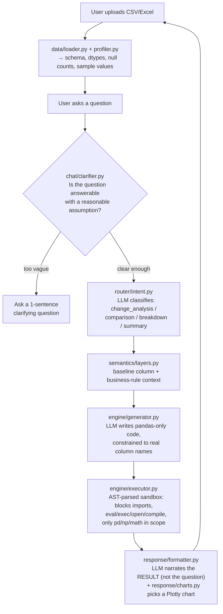

# 📊 Talk to Data

> **Ask plain-English questions about any CSV/Excel file. Get an answer, a chart, and the pandas code that produced it.**
> Built for the NatWest "Code for Purpose" India Hackathon 2025.


-F55036)

---

## Overview

Upload a CSV or Excel file, ask a question in plain English ("why did revenue drop in February?", "compare North vs South", "pie chart of sales by product"), and get back a plain-English answer, a data table, and — where it makes sense — a chart. No SQL, no pandas syntax, no manual filtering.

The core idea: the LLM never touches your data directly. It only ever sees the **schema** (column names, types, a few sample values) and writes **pandas code** against it. That code runs in a sandboxed executor, and the *result* of that code — not the LLM's own words — is what gets summarized back to you. That's the whole trust story: the model reasons about structure, not content, so it can't quietly make numbers up.

## How a query actually flows

This is the real, current wiring in `src/app.py` — not an aspirational diagram:



**Multi-file sessions:** upload more than one file into a chat and, by default, every question gets answered **against each file independently** (results shown side by side). Say "merge" or "combine" and it concatenates the files into one dataframe and answers against that instead.

## What's actually built vs. scaffolded

Being direct about this because the repo contains a few modules from the original hackathon plan that were scaffolded but never wired into the live request path — worth knowing before anyone reads the code expecting them to fire on every query:

| Module | Status |
|---|---|
| Schema-constrained code generation, AST-sandboxed execution, ambiguity clarifier, per-file/merge multi-file logic, LLM narrative + Plotly charts | ✅ **Live** — this is the real path every query takes |
| `guard/citation.py` (source/row-count footer), `guard/validator.py` (result sanity checks), `chat/history.py` (generic history helper) | 🚧 **Scaffolded, not called from `app.py`** — `app.py` does its own inline session-state history management instead, and no citation footer or post-execution validation currently reaches the UI |
| `semantics/layers.py` | ⚠️ **Real but minimal** — currently returns the column list plus one hardcoded rule (exclude cancelled/failed rows if that column exists), not a full per-dataset metric dictionary yet |

## Setup

```bash
git clone https://github.com/Nitingupta0/talk-to-data.git
cd talk-to-data

python -m venv .venv
.venv\Scripts\activate        # Windows — use `source .venv/bin/activate` on macOS/Linux
pip install -r requirements.txt

cp .env.example .env          # then paste in your own GROQ_API_KEY (https://console.groq.com)

streamlit run src/app.py      # opens at http://localhost:8501
```

## Using it

1. **Upload** one or more CSV/Excel files from the sidebar — each gets auto-profiled and the app greets you with 3 suggested questions based on its actual columns.
2. **Ask** in plain English. A few examples that map cleanly onto the four intent types: "why did revenue drop in February?" (change analysis), "compare North vs South region" (comparison), "what makes up total sales?" (breakdown), "give me a summary of this dataset" (summary). Mention "pie chart" / "line chart" / "bar chart" / etc. in the question to steer the visualization.
3. **Multi-file:** load a second file and ask a question — you'll get an answer per file by default; say "combine" to treat them as one dataset.
4. **Manage chats** from the sidebar — new chat, rename, delete. Each chat keeps its own file selection and history.

## Tech stack

| Layer | Technology |
|---|---|
| Frontend | Streamlit |
| LLM | Groq API — `llama-3.3-70b-versatile` (used for intent routing, code generation, ambiguity checks, and result narration — 4 distinct calls per query) |
| Data processing | Pandas, NumPy |
| Visualization | Plotly |
| Sandboxing | Python `ast` module — parses generated code and rejects any import or call to `eval`/`exec`/`open`/`compile`/`__import__` before it ever runs |

## Folder structure

```
talk-to-data/
├── src/
│   ├── app.py                  # Streamlit UI + orchestration (the real control flow lives here)
│   ├── data/
│   │   ├── loader.py           # CSV/Excel ingestion
│   │   └── profiler.py         # Schema, dtypes, null counts, sample values
│   ├── router/intent.py        # LLM query-intent classification
│   ├── semantics/layers.py     # Baseline column + business-rule context
│   ├── engine/
│   │   ├── generator.py        # LLM → pandas-only code
│   │   ├── executor.py         # AST-checked sandboxed execution
│   │   └── templates.py        # Per-intent prompt templates
│   ├── response/
│   │   ├── formatter.py        # LLM narrates the result + packages table/chart
│   │   └── charts.py           # Plotly chart-type routing
│   ├── chat/clarifier.py       # Ambiguity detection before execution
│   └── guard/                  # citation.py, validator.py — scaffolded, not yet wired in (see above)
├── sample_data/sales_data.csv  # Demo dataset
├── requirements.txt
└── .env.example
```

## Limitations

- Best with structured CSV/Excel files that have clear column headers
- Chart generation needs at least 2 result columns
- Groq's free tier has a daily token cap — heavy use will hit it
- No automatic retry if the LLM's generated code fails execution — the error is surfaced to the user, not retried automatically

## Roadmap

- Wire `guard/citation.py` and `guard/validator.py` into the live response path (source-citation footer + post-execution sanity checks)
- A real per-dataset semantic layer (editable metric definitions), not just the current baseline
- PDF / Google Sheets as data sources
- Natural-language alerts ("notify me when sales drop below X")
- Export a chat session as a PDF report

---

> Built for the NatWest "Code for Purpose" — India Hackathon 2025.
