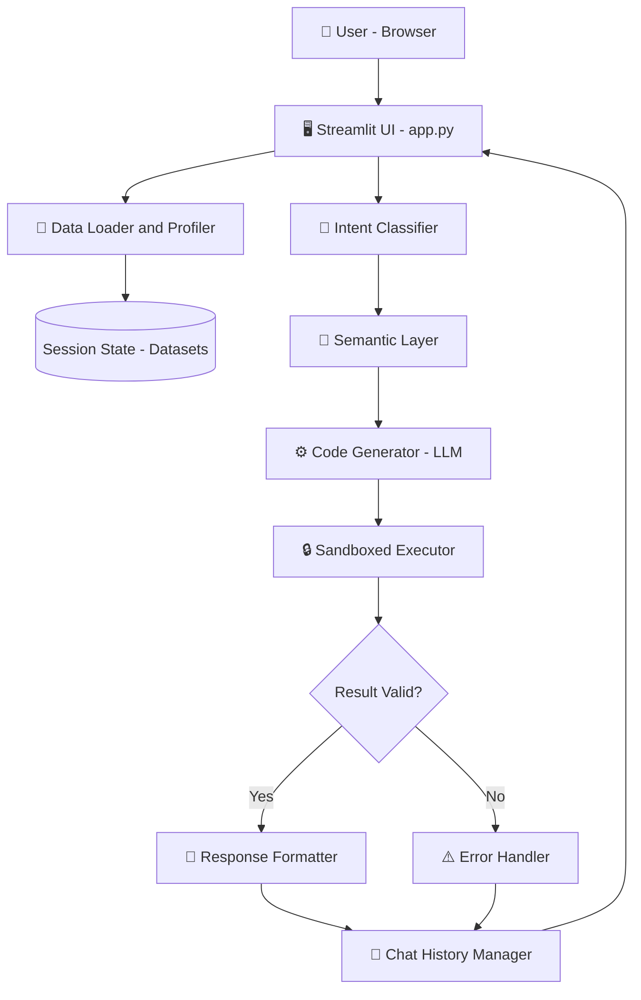
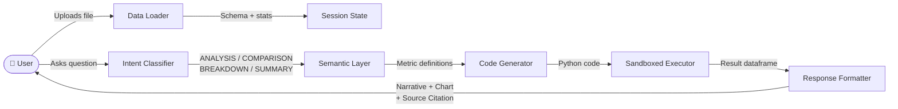
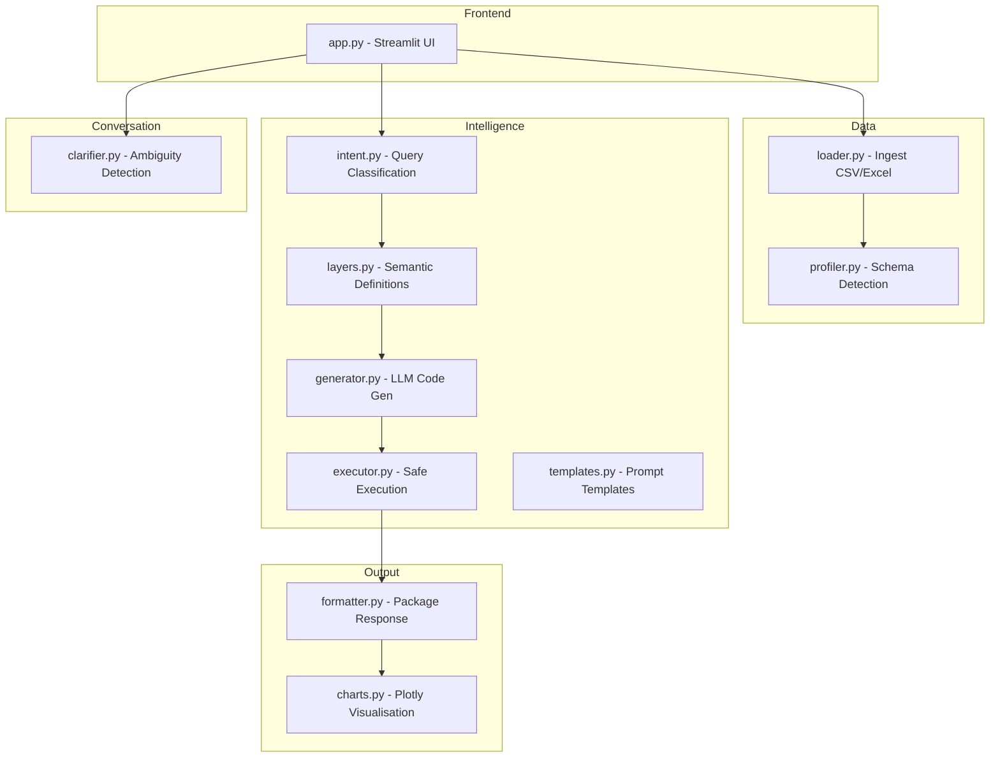
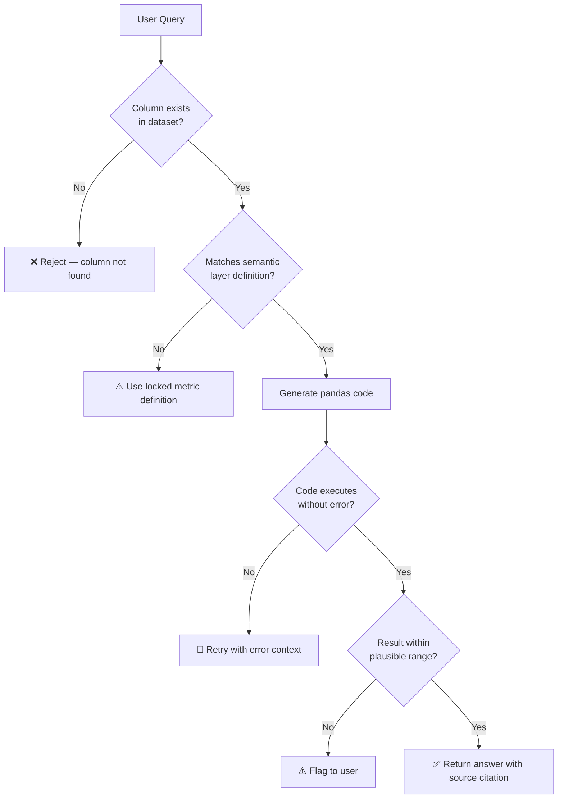

# 📊 Talk to Data — Seamless Self-Service Intelligence

> **Ask plain English questions about any dataset. Get instant, trusted, sourced answers.**
> Built for the NatWest Code for Purpose — India Hackathon 2025.

---

## 📌 Overview

**Talk to Data** is an AI-powered conversational data analysis platform. Upload any CSV or Excel file, ask questions in plain English, and receive clear answers backed by real data — no SQL, no code, no technical knowledge required.

It solves a real problem: most people can't query data without specialist skills. Talk to Data removes that barrier entirely — making data analysis truly self-service.

---

## 🎯 The Three Pillars

| Pillar | What it means | How we deliver it |
|--------|--------------|------------------|
| 🔍 **Clarity** | Answers simple enough for non-experts | Plain English responses, no jargon |
| ✅ **Trust** | Clear definitions and source transparency | Every answer cites the exact columns and rows used |
| ⚡ **Speed** | Near-instant responses, minimal steps | Upload → Ask → Answer in under 10 seconds |

---

## 🏗️ System Architecture



---

## 🔄 Request / Response Flow



---

## 🧩 Module Breakdown



---

## 📁 Folder Structure

```
talk-to-data/
├── src/
│   ├── app.py                  # Main Streamlit entry point
│   ├── data/
│   │   ├── loader.py           # CSV/Excel ingestion and profiling
│   │   └── profiler.py         # Schema detection, stats, samples
│   ├── router/
│   │   └── intent.py           # Query intent classification
│   ├── semantics/
│   │   └── layers.py           # Metric dictionary and column definitions
│   ├── engine/
│   │   ├── generator.py        # LLM to pandas code generation
│   │   ├── executor.py         # Sandboxed code execution
│   │   └── templates.py        # Per-intent prompt templates
│   ├── response/
│   │   ├── formatter.py        # Narrative + chart + citation packaging
│   │   └── charts.py           # Plotly chart generation
│   └── chat/
│       └── clarifier.py        # Ambiguity detection and follow-up
├── assets/
│   └── sample_data.csv         # Demo dataset for judges
├── docs/
│   └── architecture.md         # Extended architecture notes
├── .env.example                # Environment variable template
├── requirements.txt            # Python dependencies
└── README.md                   # This file
```

---

## 🚀 Installation and Setup

### Prerequisites

- Python 3.8 or higher
- A free Groq API key — get one at [console.groq.com](https://console.groq.com)

### Step 1 — Clone the repository

```bash
git clone https://github.com/your-username/talk-to-data.git
cd talk-to-data
```

### Step 2 — Install dependencies

```bash
pip install -r requirements.txt
```

### Step 3 — Set up your API key

Create a `.env` file in the root folder:

```bash
cp .env.example .env
```

Open `.env` and add your Groq API key:

```
GROQ_API_KEY=your_actual_api_key_here
```

> ⚠️ Never share your `.env` file or commit it to GitHub. It is already listed in `.gitignore`.

### Step 4 — Run the app

```bash
streamlit run src/app.py
```

### Step 5 — Open in browser

The app will automatically open at:

```
http://localhost:8501
```

---

## 📖 How to Use

### 1. Upload your data

In the **left sidebar**, click **Upload** and select one or more CSV or Excel files.

The app will automatically load and profile each file. After uploading, the AI will greet you with a summary and suggest questions you can ask right away.

### 2. Ask a question

Type any question in plain English in the chat box at the bottom and press **Enter**.

**Example questions you can ask:**

| Question type | Example |
|--------------|---------|
| Why did something change? | `Why did revenue drop in February?` |
| Compare two things | `Compare the North region vs South region` |
| Break down a total | `What makes up total sales?` |
| Get a summary | `Give me a weekly summary of this dataset` |
| Spot trends | `What are the key trends in this data?` |
| Find outliers | `Are there any anomalies in this dataset?` |
| Request a chart | `Plot a bar chart of revenue by region` |
| Pie chart | `Show me a pie chart of sales by product` |

### 3. Working with multiple files

You can upload **more than one file** in the same chat session:

- Questions are answered **per file independently** by default
- Say **"for both files"** or **"for each file"** to get separate answers for each file
- Say **"merge"** or **"combine"** to analyse all files together as one combined dataset

### 4. Manage your chats

| Action | How |
|--------|-----|
| Start a new chat | Click **➕ New Chat** in the sidebar |
| Switch between chats | Click any chat name in the **Conversations** list |
| Rename a chat | Click **✏️ Rename Chat**, type a new name, click Save |
| Delete a chat | Click **🗑️ Delete Chat** |

> Each chat maintains its own independent data context. Files uploaded in one chat are not accessible in another.

---

## 🛡️ Anti-Hallucination Strategy



| Risk | Mitigation |
|------|-----------|
| AI invents column names | Schema-constrained prompts — only real columns passed |
| Wrong metric definitions | Semantic layer locks definitions before code generation |
| Code errors silently | AST security check + sandboxed execution + error retry |
| Numbers out of range | Result validated against source data statistics |
| Ambiguous query | Clarification flow triggers before any execution |
| User trusts wrong answer | Full source citation on every single response |

---

## 🧰 Tech Stack

| Layer | Technology |
|-------|-----------|
| Frontend | Streamlit |
| AI Model | Groq API — `llama-3.3-70b-versatile` |
| Data Processing | Pandas, NumPy |
| Visualisation | Plotly |
| Environment | python-dotenv |
| Language | Python 3.12 |

---

## ⚠️ Limitations

- Works best with structured CSV or Excel files with clear column headers
- Very large datasets (50,000+ rows) may slow down code generation
- Chart generation requires the result to have at least 2 columns
- Free-tier Groq API has a daily token limit of 100,000 tokens

---

## 🔮 Future Improvements

- Support for PDF and Google Sheets as data sources
- Natural language alerts — notify me when sales drop below X
- Export full chat session as a PDF report
- Voice input for hands-free data querying
- User-editable semantic layer for defining custom metric definitions

---

## 📜 License

This project is licensed under the **Apache License 2.0**.

---

> Built with ❤️ for the NatWest Code for Purpose — India Hackathon 2025
