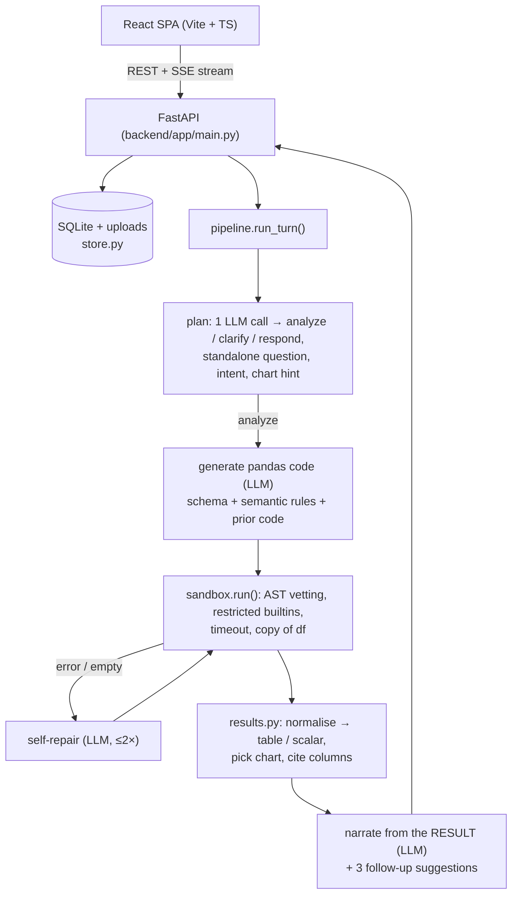

# 📊 Talk to Data

> **Ask plain-English questions about any spreadsheet. Get an answer, a chart, the table behind it, and the pandas code that produced every number.**
> Built for the NatWest "Code for Purpose" India Hackathon 2025.


-F55036)

---

## Overview

Upload a CSV, Excel, JSON or Parquet file, ask a question ("how has monthly revenue trended?", "compare channels by region", "what's total completed revenue?"), and get back a short written answer, an interactive chart, a sortable table and the exact code that ran. You don't need SQL, pandas or any manual filtering.

**The trust model:** the LLM never sees your rows. It only sees the **schema**: column names, types, detected roles and a few sample values. From that it writes **pandas code**, which runs in a locked-down sandbox on your real data. The written answer is generated **from the computed result**, not from the model's memory, and every answer shows which rows and columns it came from.

## What's new in v2

v1 was a single-file Streamlit app. v2 splits it into a **FastAPI backend** and a **React + TypeScript frontend** with hand-written CSS, and upgrades every stage of the pipeline:

| Area | v1 (Streamlit) | v2 |
|---|---|---|
| UI | Streamlit widgets with injected CSS | React SPA: light/dark themes, responsive down to phone width, streamed progress steps, chart/table/code tabs, dataset inspector drawer |
| LLM calls per question | 4: clarify, classify, generate, narrate | 3: **plan** (clarify, classify, rewrite follow-ups and pick a chart in one JSON call), generate, narrate |
| Follow-ups | Previous user messages pasted into the prompt | Planner rewrites "filter that to North" into a standalone question, and the previous code is passed in for reuse |
| Failed code | Error shown to the user | **Self-repair loop**: the error goes back to the model for up to 2 fixes. Empty results get one retry to check filter values |
| Sandbox | Blocked imports, `eval`, `exec`, `open` | Also blocks dunder access (`__class__`/`__subclasses__` escapes), reflection builtins, pandas/numpy file and network I/O (`to_csv`, `read_*`, `np.load`…), `while` loops and `__` strings (closes the `df.query` escape). Adds a wall-clock timeout and runs on a copy of the data |
| Data loading | `read_csv` / `read_excel` | Encoding fallback, delimiter sniffing, one dataset per Excel sheet, clean headers, text coerced to numbers (`"$1,200"`, `"(300)"`, `"15%"`) and dates |
| Profiling | Column names, dtypes and samples | Each column gets a role (metric / category / time / ID / text) plus stats, top values and null rate |
| Semantic layer | One hardcoded rule | Rules built from the data: month-name ordering, excluding cancelled/refunded rows **only when a status column actually contains those values**, and null warnings |
| Charts | Plotly, chosen by keyword | Chart picked from the data's shape (time → line, small positive breakdown → donut, two numeric columns → scatter), with chronological month sorting, top-30 capping and a colorblind-validated palette. You can switch chart type in the UI |
| Citations / validation | Written but never called | Wired in: every answer shows rows scanned, columns used and source files. Truncation and self-correction are flagged |
| Single-number answers | Shown as a markdown table | **Stat tile** with a compact value (304.3K), the exact value and a label built from the code ("Total revenue") |
| Persistence | Lost on refresh | SQLite: a data library shared across chats, conversations, and every message with its results |
| Multi-file | Keyword "merge" only | **Auto / Per file / Merge** toggle. Merge adds a `source_file` column so you can compare across files |
| Tests | None | 31 pytest tests (sandbox escapes, loaders, chart choice, end-to-end API with a scripted LLM) + CI |

## Architecture



Progress events (`plan → code → run → repair → explain`) stream to the browser as Server-Sent Events, so the UI shows what's happening in real time.

## Quick start

**Prerequisites:** Python 3.11+, Node 20+, and a free [Groq API key](https://console.groq.com).

```bash
git clone https://github.com/Nitingupta0/talk-to-data.git
cd talk-to-data
cp .env.example .env            # paste your GROQ_API_KEY

# 1) Backend: http://localhost:8000 (API docs at /docs)
cd backend
python -m venv .venv && source .venv/bin/activate    # Windows: .venv\Scripts\activate
pip install -r requirements.txt
uvicorn app.main:app --reload --port 8000

# 2) Frontend: http://localhost:5173 (proxies /api to :8000)
cd ../frontend
npm install
npm run dev
```

**Single-process mode:** run `npm run build` in `frontend/` and FastAPI will serve the built app from `frontend/dist`. Then `uvicorn app.main:app` on its own serves everything at http://localhost:8000.

Without an API key you can still upload files and browse them in the inspector. Questions return a clear "no model configured" message.

## Using it

1. **Add data:** drop files on the start screen, pick a bundled sample (`ecommerce_orders.csv` has 1,200 orders across 18 months, and `sales_data.csv` is a small monthly table), or reuse a file from your **data library** in the sidebar. Each file is profiled and greeted with four suggested questions.
2. **Ask:** type in the composer (Enter sends, Shift+Enter adds a new line) or click a suggestion. Name a chart type ("as a donut", "line chart") to steer the visual, or switch it afterwards with the Bar / Line / Area / Donut toggle.
3. **Verify:** open **Table** to sort and download the result as CSV, or **Code** to see the exact pandas that ran. The footer lists rows scanned and the columns used.
4. **Inspect a dataset:** click its chip in the top bar to see each column's role, stats, top values, a 100-row preview, and the business rules the assistant will apply.
5. **Multiple files:** attach several and choose **Per file** (side-by-side answers in tabs), **Merge** (one stacked table with a `source_file` column), or **Auto** (per file unless you say "combine").

## Project layout

```
talk-to-data/
├── backend/
│   ├── app/
│   │   ├── main.py        # FastAPI routes, SSE streaming, serves frontend/dist
│   │   ├── pipeline.py    # plan → generate → sandbox → repair → narrate
│   │   ├── prompts.py     # every prompt in one place
│   │   ├── sandbox.py     # AST-vetted, time-limited code execution
│   │   ├── results.py     # result normalisation, chart selection, citations
│   │   ├── data.py        # loading, cleaning, type coercion, profiling
│   │   ├── semantics.py   # derived business rules + schema prompt block
│   │   ├── store.py       # SQLite persistence + dataframe cache
│   │   ├── llm.py         # provider wrapper (Groq), swappable for tests
│   │   └── config.py      # env-driven settings
│   ├── sample_data/
│   ├── tests/             # pytest suite with a scripted fake LLM
│   └── requirements.txt
├── frontend/
│   ├── src/
│   │   ├── App.tsx        # state + layout
│   │   ├── api.ts         # typed REST client + SSE reader
│   │   ├── components/    # Sidebar, Composer, MessageView, ResultCard, ChartView, DataTable, Inspector, …
│   │   ├── styles.css     # design tokens (light/dark) + all component styles
│   │   └── theme.ts       # theme hook + chart palette
│   └── vite.config.ts
└── .github/workflows/ci.yml
```

## API

| Method | Path | Purpose |
|---|---|---|
| `GET` | `/api/health` | Status and whether an LLM key is configured |
| `GET/POST` | `/api/datasets` | List or upload (multipart `files`) datasets |
| `GET/DELETE` | `/api/datasets/{id}` | Profile + preview rows / delete |
| `GET` | `/api/samples` · `POST /api/samples/{name}` | Bundled sample files |
| `GET/POST` | `/api/chats` | List / create conversations |
| `GET/PATCH/DELETE` | `/api/chats/{id}` | Read with messages / rename or set mode / delete |
| `PUT` | `/api/chats/{id}/datasets` | Set attached datasets (adds a welcome message per new file) |
| `POST` | `/api/chats/{id}/messages` | Ask a question. Responds with a `text/event-stream` of status events and the final message |

Interactive docs: http://localhost:8000/docs.

## Development

```bash
cd backend && pip install -r requirements-dev.txt && pytest -q   # backend tests
cd frontend && npm run build                                      # typecheck + production build
```

## Security notes

The sandbox is designed for a local or trusted-team tool. It blocks the known escape routes from generated pandas code (imports, dunder traversal, reflection, file and network I/O, string-eval paths) and stops waiting after a timeout. The timed-out thread is abandoned, not killed, so a runaway query can keep using CPU until it finishes. It is **not** a hardened multi-tenant isolation boundary. If you expose this publicly, run the backend in a container with no credentials, a read-only filesystem and no outbound network.
